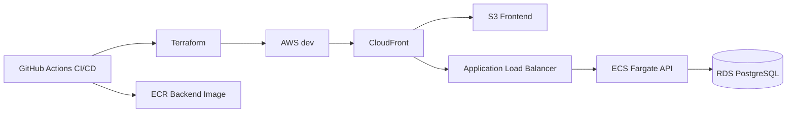
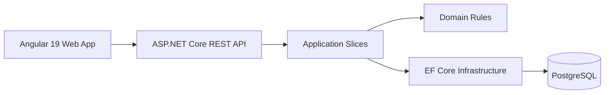

# Students Platform

Aplicacion web para gestion academica de estudiantes, construida como una entrega tecnica end-to-end con backend, frontend, infraestructura como codigo en `Terraform` y despliegue automatizado mediante `CI/CD`.

## Aplicacion en Vivo

Ambiente `dev` desplegado en AWS:

```text
https://d3qmdcbwj1io4v.cloudfront.net/
```

La aplicacion publica el frontend Angular por `CloudFront + S3` y enruta la API por `/api` hacia el backend en `ECS Fargate` mediante un `Application Load Balancer`.

## Resumen Ejecutivo

La solucion implementa un flujo completo de registro academico con CRUD de estudiantes, seleccion de materias, validaciones de negocio criticas, consulta de otros registros y visualizacion de companeros por clase. El objetivo fue construir una base profesional, moderna y facil de explicar en entrevista, sin sobreingenieria.

Ademas del producto funcional, el repositorio incluye una plataforma cloud reproducible: `Terraform` provisiona red, `ECR`, `ECS Fargate`, `RDS PostgreSQL`, `S3`, `CloudFront`, `ALB`, logs y alarmas basicas. `GitHub Actions` ejecuta validacion, pruebas, build, publicacion de imagen Docker y despliegue continuo del ambiente `dev`.

El backend esta organizado como `Modular Monolith` con `Vertical Slice Architecture` y limites pragmaticos de `Clean Architecture`. El frontend usa `Angular 19` con `standalone components`, formularios reactivos tipados y una UI sobria orientada a demostracion ejecutiva.

## Flujo DevOps

- `Terraform` define y actualiza la infraestructura de AWS desde `infra/`.
- `GitHub Actions` autentica contra AWS con `OIDC`, sin llaves largas en el repositorio.
- El workflow `deploy-dev` compila backend/frontend, ejecuta pruebas, publica imagen en `ECR`, aplica Terraform y sube el frontend a `S3`.
- `CloudFront` expone la aplicacion web y redirige `/api/*` al backend.
- El workflow `manage-dev-power` permite hibernar o activar `dev` para reducir consumo de creditos.



## Arquitectura Propuesta

- Backend monolitico modular con cuatro proyectos: `Api`, `Application`, `Domain`, `Infrastructure`.
- Casos de uso agrupados por feature: catalogo, estudiantes e inscripciones.
- API publica `REST` para el navegador.
- Persistencia principal en `PostgreSQL` con inicializacion automatica del esquema y seed.
- Frontend por features con consumo de API limpio, validaciones tempranas y estado simple.
- `ProblemDetails` para errores y logging estructurado con contexto.



## Stack Tecnologico Final

- Backend: `ASP.NET Core 8`
- Frontend: `Angular 19`
- Persistencia: `PostgreSQL 16`
- ORM: `Entity Framework Core`
- Infraestructura cloud: `Terraform`
- Cloud: `AWS ECS Fargate`, `RDS PostgreSQL`, `S3`, `CloudFront`, `ALB`, `ECR`, `CloudWatch`
- CI/CD: `GitHub Actions` con `OIDC` hacia AWS
- Testing backend: `xUnit`
- Integracion API: `WebApplicationFactory` + `SQLite in-memory`
- Documentacion: `Markdown` + `Mermaid`
- Infra local: `Docker Compose`

## Estructura del Repositorio

```text
/
  .github/
    workflows/
  compose.yml
  Dockerfile
  students-platform.http
  README.md
  docs/
    ARCHITECTURE.md
    DELIVERY_DOCUMENT.md
    QA_STRATEGY.md
    TEST_MATRIX.md
    MANUAL_CHECKLIST.md
    ADR/
  src/
    backend/
      StudentsPlatform.Api/
      StudentsPlatform.Application/
      StudentsPlatform.Domain/
      StudentsPlatform.Infrastructure/
    frontend/
  infra/
    bootstrap/
    shared/
    live/
    modules/
  tests/
    README.md
    backend/
      StudentsPlatform.Domain.Tests/
      StudentsPlatform.Api.IntegrationTests/
```

## Modelo de Dominio

Entidades principales:

- `Student`
- `Professor`
- `Subject`
- `Enrollment`
- `EnrollmentSubject`

Reglas implementadas explicitamente:

- exactamente 3 materias por estudiante
- maximo 9 creditos por estudiante
- no repetir materias dentro de la misma inscripcion
- no seleccionar dos materias del mismo profesor
- catalogo semilla de 10 materias y 5 profesores
- detalle de estudiante con profesor por materia y companeros por clase

## Plan de Implementacion por Agente

- `Solution Architect`: definio arquitectura, modelo, ADRs y estructura documental.
- `Backend Lead`: implemento dominio, slices, API REST, seed, persistencia y pruebas.
- `Frontend Lead`: estructuro contratos, facade y base del consumo API.
- `Technical Lead`: integro y completo la UI Angular, verifico compilacion, alinio docs y cerro entregables.
- `QA / Test Engineer`: definio estrategia QA, matriz de pruebas y checklist manual.
- `DevOps / IaC Advisor`: dejo `compose.yml`, Terraform para AWS, OIDC y workflows de CI/CD.

## Entregables Incluidos

- codigo fuente completo de backend y frontend
- README profesional
- `docs/ARCHITECTURE.md`
- `docs/DELIVERY_DOCUMENT.md`
- ADRs minimos y documentacion de infraestructura
- diagramas Mermaid
- estrategia QA, matriz de pruebas y checklist manual
- archivo `.http` para probar endpoints
- `compose.yml` para PostgreSQL local
- `Dockerfile` para contenerizar el backend
- base de `Terraform` para AWS en `infra/`
- workflows de `GitHub Actions` para validacion, plan, despliegue, promocion y control de energia de `dev`
- pruebas automatizadas ejecutables

## Como Probar el Ambiente Dev

Frontend:

```text
https://d3qmdcbwj1io4v.cloudfront.net/
```

Endpoints principales por CloudFront:

```bash
curl https://d3qmdcbwj1io4v.cloudfront.net/api/subjects
curl https://d3qmdcbwj1io4v.cloudfront.net/api/professors
curl https://d3qmdcbwj1io4v.cloudfront.net/api/students
```

La URL publica de CloudFront se mantiene estable mientras Terraform actualice la misma distribucion. Cambiaria si se destruye/recrea la distribucion o si se pierde el state remoto.

## Como Ejecutar Localmente

### 1. Base de datos

```powershell
docker compose up -d postgres
```

El contenedor publica PostgreSQL en `localhost:5433`.

Nota: la API inicializa esquema y seed automaticamente al arrancar.

### 2. Backend

```powershell
dotnet restore StudentsPlatform.sln
dotnet run --project .\src\backend\StudentsPlatform.Api
```

La API queda disponible en `http://localhost:5277` y Swagger en `http://localhost:5277/swagger`.

### 3. Frontend

```powershell
cd .\src\frontend
npm install
npm start
```

La aplicacion web queda disponible en `http://localhost:4200` usando proxy hacia la API.

### 4. Pruebas

```powershell
dotnet test StudentsPlatform.sln
```

### 5. Pruebas manuales de API

Usa el archivo [`students-platform.http`](./students-platform.http) desde VS Code o Rider.

## Diseno de la API

Endpoints principales:

- `GET /api/students`
- `GET /api/students/{id}`
- `POST /api/students`
- `PUT /api/students/{id}`
- `PUT /api/students/{id}/subjects`
- `DELETE /api/students/{id}`
- `GET /api/subjects`
- `GET /api/professors`

Los errores se exponen como `ProblemDetails` con `traceId` y, cuando aplica, diccionario `errors` por campo.

## Verificacion Realizada

Validado en este workspace:

- `dotnet test StudentsPlatform.sln` -> 12 pruebas pasando
- `npm run build` en `src/frontend` -> compilacion exitosa

Limitacion de entorno durante esta sesion:

- no fue posible validar el arranque real contra PostgreSQL en Docker porque el engine local no estaba levantado al momento del smoke test

## Decisiones Tecnicas Relevantes

- `Modular Monolith` para mantener simplicidad operativa y claridad arquitectonica.
- `Vertical Slices` para agrupar request, validacion y caso de uso por feature.
- `REST` como contrato publico del frontend por compatibilidad natural con navegador.
- `PostgreSQL` por su ajuste al dominio relacional y su soporte robusto de constraints.
- `Angular standalone` con estado simple en lugar de NgRx para evitar complejidad innecesaria.

## Evidencia de Cumplimiento del Enunciado

- CRUD de estudiantes implementado en API y UI.
- 10 materias y 5 profesores con seed controlado.
- 3 creditos por materia y maximo 9 por estudiante.
- exactamente 3 materias y sin profesor repetido.
- consulta de otros estudiantes desde listado general.
- detalle por estudiante con profesor y companeros por materia.
- validacion duplicada en frontend y backend, con fuente de verdad en servidor.

## Documentacion Complementaria

- [`docs/ARCHITECTURE.md`](./docs/ARCHITECTURE.md)
- [`docs/DELIVERY_DOCUMENT.md`](./docs/DELIVERY_DOCUMENT.md)
- [`docs/QA_STRATEGY.md`](./docs/QA_STRATEGY.md)
- [`docs/TEST_MATRIX.md`](./docs/TEST_MATRIX.md)
- [`docs/MANUAL_CHECKLIST.md`](./docs/MANUAL_CHECKLIST.md)
- [`docs/ADR`](./docs/ADR)
- [`infra/README.md`](./infra/README.md)

## Mejoras Futuras

- autenticacion y autorizacion por roles
- migraciones versionadas para entornos productivos
- exportacion de reportes
- observabilidad ampliada con metricas y trazas
- dominio propio y certificado administrado para reemplazar la URL generada de CloudFront

