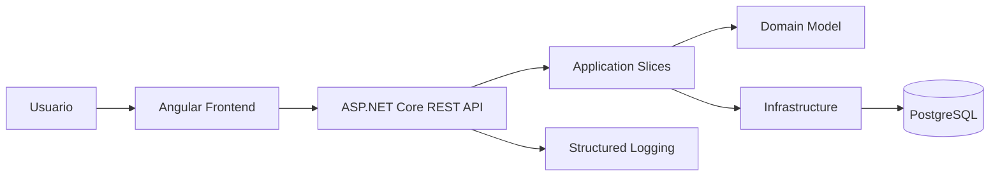
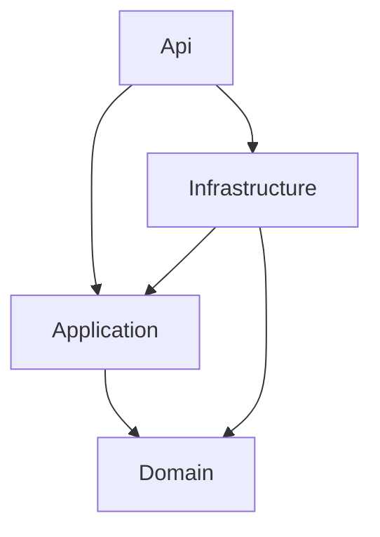
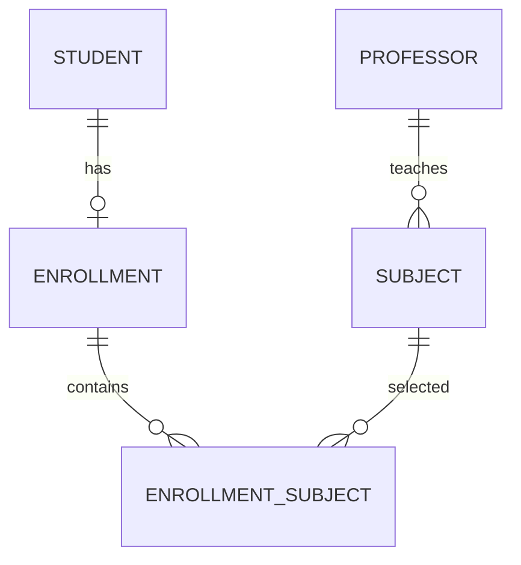

# Architecture Overview

## Proposito

Este documento explica la arquitectura finalmente implementada para la prueba tecnica de registro de estudiantes. El objetivo es que la solucion sea defendible en entrevista, ejecutable localmente y proporcional al problema.

## Resumen Ejecutivo

La solucion se implementa como un `modular monolith` con `vertical slices` en el backend y un frontend Angular organizado por features. La prioridad fue cumplir el enunciado con claridad, centralizar reglas criticas en servidor y mantener una experiencia de uso profesional sin inflar el stack.

## Principios de Diseno

- `Single deployable backend`
- `Feature-oriented design`
- `Business rules first`
- `Pragmatic clean boundaries`
- `Server-side validation as source of truth`
- `Simple typed UI contracts`
- `Complexity proportional to the problem`

## Vista General



## Backend

### Estilo Arquitectonico

El backend combina tres decisiones complementarias:

- `Modular Monolith`: un solo despliegue con limites logicos claros.
- `Vertical Slice Architecture`: cada feature agrupa endpoints, requests, handlers y respuesta.
- `Clean Architecture` pragmatica: dependencias hacia adentro, sin capas ceremoniales innecesarias.

### Estructura Implementada

```text
src/backend/
  StudentsPlatform.Api/
  StudentsPlatform.Application/
  StudentsPlatform.Domain/
  StudentsPlatform.Infrastructure/
```

### Responsabilidad por Proyecto

- `Api`: composicion, endpoints REST, middleware y configuracion.
- `Application`: casos de uso, DTOs y coordinacion de reglas de entrada.
- `Domain`: entidades y reglas de negocio puras.
- `Infrastructure`: EF Core, PostgreSQL, seed e implementacion tecnica.

### Regla de Dependencias



## Dominio

### Entidades Principales

- `Student`
- `Professor`
- `Subject`
- `Enrollment`
- `EnrollmentSubject`

### Reglas de Negocio Implementadas

- un estudiante debe seleccionar exactamente 3 materias
- el maximo por estudiante es 9 creditos
- no se pueden repetir materias dentro de una inscripcion
- no se pueden seleccionar dos materias del mismo profesor
- cada materia vale 3 creditos
- el catalogo parte de seed con 10 materias y 5 profesores
- el detalle del estudiante expone solo nombres de companeros por materia

### Vista de Dominio



## API REST

### Endpoints Implementados

- `GET /api/students`
- `GET /api/students/{id}`
- `POST /api/students`
- `PUT /api/students/{id}`
- `PUT /api/students/{id}/subjects`
- `DELETE /api/students/{id}`
- `GET /api/subjects`
- `GET /api/professors`

### Criterios de Respuesta

- `200 OK` para consultas exitosas
- `201 Created` para altas
- `204 No Content` para eliminaciones
- `400 Bad Request` para reglas de negocio o validacion
- `404 Not Found` cuando el recurso no existe
- `409 Conflict` cuando existe un estado inconsistente

### Manejo de Errores

La API devuelve `ProblemDetails` con:

- `type`
- `title`
- `status`
- `detail`
- `traceId`
- `errors` cuando aplica a validaciones de campo

## Frontend

### Enfoque

Angular 19 con:

- `standalone components`
- formularios reactivos tipados
- facade simple por feature
- consumo REST sin NgRx
- validaciones de UX alineadas con el backend

### Pantallas Implementadas

- listado de estudiantes
- alta de estudiante
- edicion de estudiante
- detalle de estudiante

### Decision de UX

La UI prioriza:

- lectura clara para entrevista
- mensajes de error accionables
- separacion entre datos del estudiante e inscripcion
- feedback temprano sin reemplazar la validacion del servidor

## Persistencia

Se elige `PostgreSQL` por:

- consistencia relacional
- buen soporte de constraints e indices
- modelo natural para estudiantes, materias, profesores e inscripciones

Para mantener el MVP realista, la API inicializa esquema y seed automaticamente al arrancar. Esto reduce friccion local y evita introducir complejidad de despliegue no esencial para la prueba.

## Observabilidad

- logging estructurado por request y caso de uso
- middleware centralizado de errores
- respuestas trazables con `traceId`

## Testing

### Cobertura Implementada

- reglas del dominio
- catalogo semilla
- CRUD principal de estudiantes
- validaciones criticas de inscripcion
- consulta de companeros por materia

### Capas de Prueba

- unitarias de dominio
- integracion sobre endpoints REST

## Complejidad Deliberadamente Excluida

Para mantener foco en el valor real del reto, el MVP no introduce:

- microservicios
- mensajeria
- event sourcing
- Kubernetes
- autenticacion compleja
- Terraform obligatorio

## Estrategia de Evolucion

La solucion puede crecer sin rediseño mayor hacia:

- autenticacion y autorizacion
- auditoria
- exportaciones
- migraciones versionadas de base de datos
- IaC minima si el despliegue cloud entra en alcance
