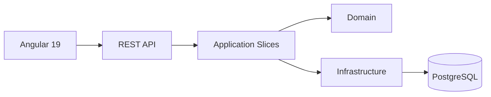

# Delivery Document

## Objetivo de la Solucion

Entregar una aplicacion web de registro de estudiantes que cumpla el enunciado funcional y, al mismo tiempo, permita defender decisiones arquitectonicas razonables en una entrevista para rol de liderazgo tecnico.

## Resumen Funcional

La solucion construida permite:

- crear, consultar, editar y eliminar estudiantes
- seleccionar materias para cada estudiante con validaciones de negocio
- consultar el catalogo de materias y profesores desde datos semilla
- ver otros estudiantes registrados
- consultar el detalle de cada estudiante con materias, profesor y companeros por clase

## Arquitectura Elegida

- Backend: `ASP.NET Core 8` con `Modular Monolith` + `Vertical Slices`
- Frontend: `Angular 19` con `standalone components`
- Persistencia: `PostgreSQL`
- API publica: `REST`
- Testing: `xUnit` para dominio e integracion



## Reglas de Negocio Implementadas

- exactamente 3 materias por estudiante
- maximo 9 creditos por estudiante
- no duplicidad de materias en una misma inscripcion
- no seleccion de dos materias dictadas por el mismo profesor
- seed inicial con 10 materias, 5 profesores y 3 creditos por materia
- consulta de otros estudiantes registrados
- visualizacion de nombres de companeros por cada materia inscrita
- validaciones redundantes en frontend y backend, con enforcement definitivo en servidor

## Tecnologias Usadas

- `.NET 8`
- `Angular 19`
- `Entity Framework Core`
- `PostgreSQL`
- `xUnit`
- `Docker Compose`
- `Markdown` + `Mermaid`

## Evidencia de Cumplimiento Punto por Punto

| Requisito | Implementacion |
|---|---|
| CRUD de estudiantes | Endpoints REST y pantallas de listado, creacion, edicion y detalle |
| Registro en linea | Formulario Angular conectado a API REST |
| 10 materias | Seed controlado en infraestructura |
| 3 creditos por materia | Catalogo semilla y validacion de credito total |
| Exactamente 3 materias | Regla de dominio + validacion UI + enforcement backend |
| 5 profesores, 2 materias cada uno | Seed semilla reproducible |
| No repetir profesor | `EnrollmentSelectionPolicy` y validacion frontend |
| Ver registros de otros estudiantes | `GET /api/students` + vista principal |
| Ver nombres de companeros por clase | `GET /api/students/{id}` con `classmates` por materia |

## Instrucciones de Ejecucion

### Backend

```powershell
dotnet restore StudentsPlatform.sln
dotnet run --project .\src\backend\StudentsPlatform.Api
```

### Frontend

```powershell
cd .\src\frontend
npm install
npm start
```

### Base de datos local

```powershell
docker compose up -d postgres
```

El contenedor publica PostgreSQL en `localhost:5433`.

## Evidencia Tecnica Ejecutada en Esta Entrega

- `dotnet test StudentsPlatform.sln` ejecutado con 12 pruebas exitosas
- `npm run build` ejecutado con compilacion exitosa del frontend

## Artefactos Entregados

- codigo fuente completo
- README principal
- documento de arquitectura
- ADRs minimos y ADR opcional de Terraform
- documento de entrega
- archivos de QA y matriz de pruebas
- archivo `.http`
- `compose.yml` para PostgreSQL local

## Posibles Mejoras Futuras

- autenticacion y autorizacion
- migraciones versionadas para produccion
- exportacion de informacion
- despliegue automatizado con IaC minima
- observabilidad avanzada con metricas y trazas

